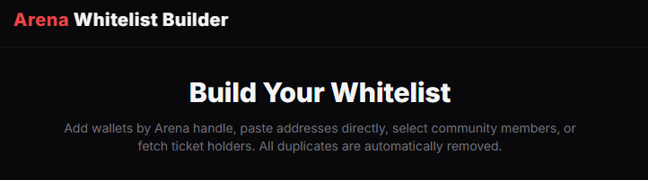

# Graft Whitelist Tool

Built for **Avalanche Build Games – Stage 2** 🔺

# Graft Whitelist Tool

## Overview

The **Graft Whitelist Tool** is a lightweight web application designed to help projects create high-quality wallet whitelists quickly and transparently.

Instead of manually collecting wallet addresses across multiple platforms, the tool allows projects to gather wallets from different community signals and generate a clean whitelist ready for token launches or NFT mints.

This tool is part of the **Graft ecosystem**, a set of tools being built to improve community engagement and launch quality within the Avalanche ecosystem.

---

## Why Use This Tool

Whitelist creation is often inefficient and error-prone. Many projects collect wallet addresses manually, which can result in duplicates, bots, or poorly curated lists.

The Graft Whitelist Tool solves this by:

- Collecting wallet addresses from multiple sources
- Validating wallet formats automatically
- Removing duplicate entries
- Allowing users to preview and filter holders
- Exporting clean whitelist files ready for use

The goal is to make whitelist generation **faster, cleaner, and more community-driven**, helping improve the quality of launches on Avalanche.

---

## Key Features

- Arena username wallet lookup
- Fetch wallet addresses from Arena communities
- Retrieve ticket holder wallets
- Manual wallet input
- Wallet validation
- Automatic deduplication
- Preview and selection before adding to whitelist
- Export as CSV or copy to clipboard

---

## Live MVP

You can test the live MVP here:

https://graft.bio/pages/whitelist/

---

## Quick Start

1. Open the live tool
2. Enter an Arena username or fetch community members
3. Preview the wallets retrieved
4. Select the wallets you want to include
5. Export the whitelist as CSV

The process takes less than a minute and generates a clean wallet list ready for token launches.

---

## Technical Structure

The application is built as a **client-side web application**.

### Tech Stack

- HTML5
- CSS / TailwindCSS
- Vanilla JavaScript
- Arena API integration

### Architecture

The tool operates fully in the browser:

User → Web Interface → Arena API → Wallet Processing → Whitelist Export

No backend server or database is required. All wallet processing and validation happens client-side.

---

## Smart Contracts

This project does **not currently use smart contracts**.

Wallet data is retrieved through the **Arena API**, and the whitelist generation logic runs entirely in the browser.

Future versions may include optional on-chain integrations for whitelist verification.

---

## Future Development

The Whitelist Tool is only the **first layer of the Graft ecosystem**.

Planned expansions include:

- **The Glitch** – an interactive system designed to increase on-chain activity and engagement
- **Points System & Leaderboard** – encouraging participation and community interaction
- Additional integrations for more community data sources
- Potential on-chain whitelist verification

The goal is to evolve Graft into a toolkit that supports **better launches and stronger community engagement across Avalanche**.

---

## Status

MVP submitted for **Avalanche Build Games – Stage 2**.

The current version demonstrates the core functionality of generating and exporting wallet whitelists.

---

## Acknowledgements

Special thanks to **NetWhizCrypto** for continuous feedback and support during development.

---

## License

Open for experimentation and community feedback.
